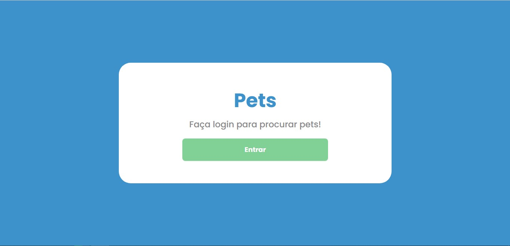
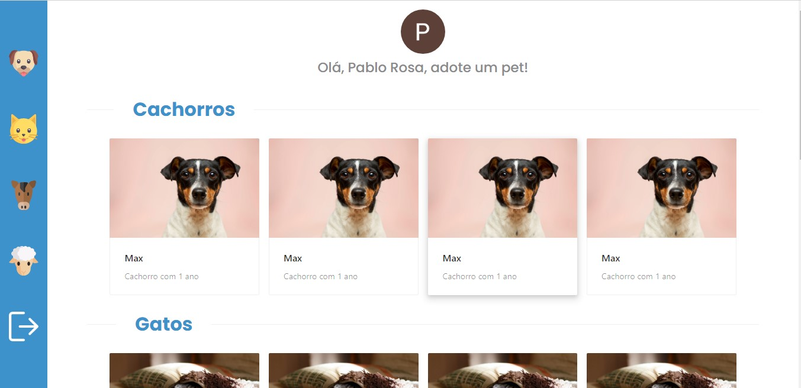

<h1 align="center" style="color:#3E92CC">
  Pets
</h1>

<p align="center">

   <a href="https://www.linkedin.com/in/pablo-rosa-68136a1b2/">
      
   </a>
  

  <a href="https://github.com/PabloRSantos/Pets/commits/master">
    
  </a>

</p>


<div align="center">
  <sub>Projeto feito para a adoção de pets. Feito com ❤︎ por
    <a href="https://github.com/PabloRSantos">Pablo Rosa</a>
  </sub>
</div>

# :pushpin: Índice

- [Sobre](#sobre)
- [Tecnologias Utilizadas](#tecnologias-utilizadas)
- [Como Usar](#como-usar)
- [Como Contribuir](#como-contribuir)

<a id="sobre"></a>

## :bookmark: Sobre

O <strong>Pets</strong> é uma aplicação Web para seus usuários adotarem diversos animais.

<a id="tecnologias-utilizadas"></a>

## :rocket: Tecnologias Utilizadas

O projeto foi desenvolvido utilizando as seguintes tecnologias

- [TypeScript](https://www.typescriptlang.org/)
- [React](https://pt-br.reactjs.org/)
- [AntDesign](https://ant.design/)
- [Auth0](https://auth0.com/)


### Projeto Web
<div>
   
   
   
</div>

<a id="como-usar"></a>

# :construction_worker: Como usar
  ### **Pré-requisitos**

  - É **necessário** possuir o **[Node.js](https://nodejs.org/en/)** instalado na máquina
  - Também, é **preciso** ter um gerenciador de pacotes seja o **[NPM](https://www.npmjs.com/)** ou **[Yarn](https://yarnpkg.com/)**.

```bash
# Clone o repositório
$ git clone https://github.com/PabloRSantos/Pets.git
```

### Executando projeto Web


```bash
# Entre na pasta 
$ cd Pets

# Instale as depêndencias
$ npm install

# Inicie a aplicação
$ npm start

```

<a id="como-contribuir"></a>

## :tada: Como contribuir

- Faça um Fork desse repositório
- Crie uma branch com a sua feature: `git checkout -b my-feature`
- Commit suas mudanças: `git commit -m 'feat: My new feature'`
- Push a sua branch: `git push origin my-feature`

---

<h4 align="center">
    Feito com 💜 by <a href="https://www.linkedin.com/in/pablo-rosa-68136a1b2/" target="_blank">Pablo Rosa</a>
</h4>
